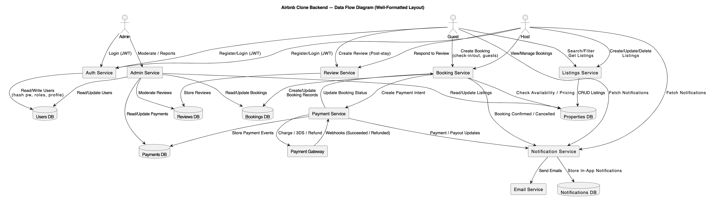

# Data Flow Diagram (DFD) — Airbnb Clone Backend
_Updated: 2025-10-26_

This folder contains the **DFD** showing how data moves between external entities, backend processes, and data stores.

## Scope
- **External Entities:** Guest, Host, Admin, Payment Gateway, Email Service
- **Processes:** Auth Service, Listings Service, Booking Service, Payment Service, Review Service, Notification Service, Admin Service
- **Data Stores:** Users DB, Properties DB, Bookings DB, Payments DB, Reviews DB, Notifications DB

## Notes
- Payment events come from provider webhooks (signed).
- Booking creation updates Bookings DB and triggers Payment Service.
- Notification Service sends email via provider; in-app notifications stored in DB.
