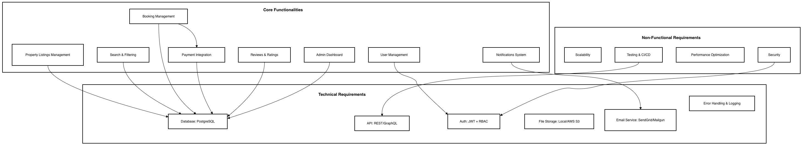

# Features & Functionalities — Airbnb Clone Backend
_Updated: 2025-10-25_

This document enumerates the **backend** features required for the Airbnb Clone. It is organized by **Core Functionalities**, **Technical Requirements**, and **Non‑Functional Requirements**. Use it as the single source of truth for scope and acceptance during implementation.

## Core Functionalities

### 1) User Management
- **Registration (Guest / Host)**: email sign‑up, password hashing (bcrypt), optional referral.
- **Login & Sessions**: JWT access/refresh tokens; OAuth (Google, Facebook) optional.
- **Profile Management**: avatar photo, name, contact info, language, currency, host profile (about, payout details).
- **Account Security**: email verification, password reset, MFA (optional).

### 2) Property Listings Management
- **Create Listing (Host)**: title, description, type, location (geo), base price, photos, amenities, house rules, availability calendar.
- **Update/Delete Listing** (Host).
- **Availability Management**: set blocked dates, seasonal pricing (optional).
- **Media Handling**: image upload, basic validation, EXIF strip.

### 3) Search & Filtering
- **Search** by location (text + geo), date range, guest count.
- **Filters**: price range, amenities, property type, instant book, rating.
- **Sorting & Pagination**: price asc/desc, rating, relevance; cursor/page pagination.
- **Caching**: hot queries cached in Redis (optional).

### 4) Booking Management
- **Create Booking (Guest)**: date validation (no overlaps), price quote (nightly × nights + fees + taxes), hold window (optional).
- **Cancellation** (Guest/Host): apply cancellation policy (flexible/moderate/strict).
- **Booking Status**: pending, confirmed, canceled, completed; timeline of state changes.
- **Host Calendar Sync**: iCal import/export (optional).

### 5) Payments
- **Guest Payment**: Stripe/PayPal charge, 3‑D Secure where required.
- **Payouts to Hosts**: scheduled after check‑out minus platform fee; support multiple currencies.
- **Refunds/Disputes**: partial/full refund per policy and payment provider webhooks.
- **Ledger**: store immutable payment events for auditability.

### 6) Reviews & Ratings
- **Review**: guest can review listing (text + rating) after completed booking only.
- **Host Response**: optional public response.
- **Moderation**: profanity/abuse detection (basic rules).

### 7) Notifications
- **Email** (SendGrid/Mailgun) for booking confirmations, cancellations, payout notifications.
- **In‑App** notifications (REST endpoint) + preferences (enable/disable).

### 8) Admin
- **Admin Portal**: manage users, listings, bookings, payouts, disputes.
- **Metrics & Reports**: revenue, occupancy, conversion (future).

---

## Technical Requirements

### Database
- **Relational (PostgreSQL)** with the following tables (minimal):
  - `users`, `sessions` (optional), `properties`, `property_photos`, `amenities`, `property_amenities` (join),
  - `bookings`, `payments`, `refunds` (optional), `reviews`, `notifications`, `audit_logs`.
- **Indexes**: geo (lat/lng), text search, composite indexes for bookings and availability.
- **Migrations**: versioned schema migrations.

### API
- **REST** (JSON): `/api/v1/**`, proper verbs and 2xx/4xx/5xx status codes.
- **GraphQL** (optional) for aggregate queries on listings/search.
- **OpenAPI** (Swagger) documentation auto‑generated from routes/schemas.

### AuthN/AuthZ
- **JWT** access + refresh tokens, rotation & blacklist on logout.
- **RBAC**: roles `guest`, `host`, `admin` enforced via middleware/guards.
- **Password Policy** and rate‑limited login.

### File Storage (Scenario)
- **Local disk for implementation**; cloud (S3/Cloudinary) ready via adapter interface.
- Virus/mime checks for uploads (basic).

### Third‑Party Services
- **Email**: SendGrid/Mailgun.
- **Payments**: Stripe/PayPal, inbound webhooks secured via signatures.

### Error Handling & Logging
- Centralized error handler, structured logs (JSON), correlation IDs, basic observability.

---

## Non‑Functional Requirements
- **Scalability**: stateless app servers behind a load balancer; horizontal scaling.
- **Security**: HTTPS, HSTS, input validation, prepared statements, secret management.
- **Performance**: Redis caching for hot paths; N+1 query prevention; pagination everywhere.
- **Testing**: unit + integration tests (pytest or Jest), API contract tests (Dredd/Postman/Newman).

## Deliverables
- `features-and-functionalities/` exported PNG diagram created in Draw.io (see repository structure).
- This README serves as the canonical feature list and acceptance checklist.
