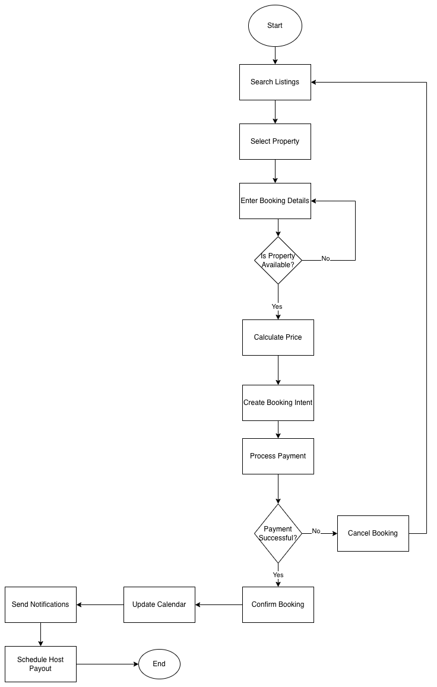

# Flowchart — Property Booking Process
_Updated: 2025-10-26_

This flowchart illustrates the **booking workflow** from the guest’s perspective, showing each backend interaction step by step.

---

## 🎯 Objective
Visualize how a guest books a property, how data flows through services, and where validation and payment occur.

---

## Steps in the Flow

1️⃣ **Start** — Guest initiates booking.  
2️⃣ **Search Listings** — Guest searches properties using location, date range, and filters.  
3️⃣ **Select Property** — Guest chooses a listing.  
4️⃣ **Enter Booking Details** — Specify check-in/out dates and number of guests.  
5️⃣ **Availability Check** — System validates that the property isn’t already booked.  
  🟢 *If available → proceed to price quote*  
  🔴 *If not → return to date selection.*  
6️⃣ **Price Calculation** — Backend computes cost (base price × nights + fees + taxes).  
7️⃣ **Create Booking Intent** — Temporary booking entry marked as *pending*.  
8️⃣ **Payment Processing** — System redirects to payment gateway (Stripe/PayPal).  
  🟢 *If payment succeeds → confirm booking*  
  🔴 *If payment fails → cancel booking and notify user.*  
9️⃣ **Booking Confirmation** — System marks booking *confirmed* and updates calendar.  
🔟 **Send Notifications** — Email/in-app notifications to guest and host.  
🧾 **Payout Scheduling** — For hosts, payout scheduled post-checkout.  
✅ **End**

