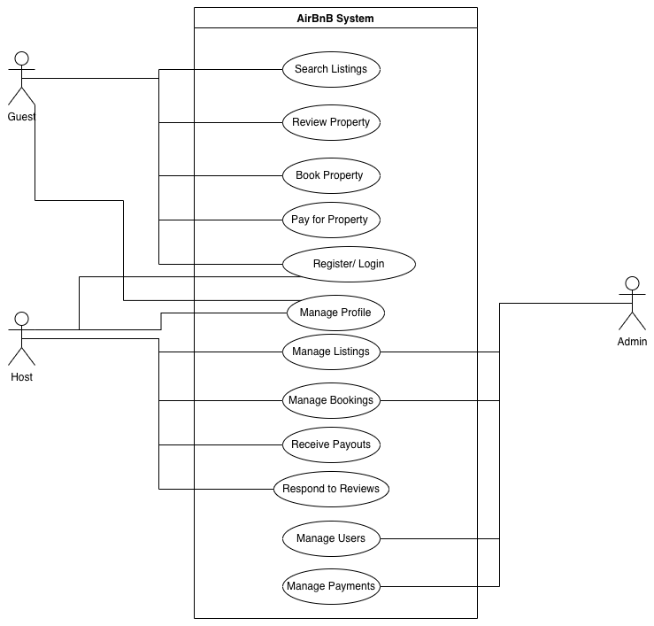

# Use Case Diagram — Airbnb Clone Backend
_Updated: 2025-10-25_

This folder contains the **use case diagram** illustrating how users interact with the Airbnb Clone backend.  
It identifies the primary **actors** (Guest, Host, Admin) and their key interactions with system features such as authentication, property management, bookings, payments, reviews, and notifications.

---

## 🎭 Actors
- **Guest** – browses listings, books stays, makes payments, leaves reviews.
- **Host** – creates and manages property listings, manages bookings, responds to reviews, receives payouts.
- **Admin** – monitors and moderates users, listings, and transactions.

---

## 💡 Key Use Cases
| Category | Use Case | Actors Involved |
|-----------|-----------|-----------------|
| Authentication | Register / Login / Manage Profile | Guest, Host |
| Listings | Create / Edit / Delete Property | Host |
| Search | Search and Filter Properties | Guest |
| Booking | Create / Cancel Booking | Guest, Host |
| Payments | Guest Payment & Host Payout | Guest, Host |
| Reviews | Leave / Respond to Reviews | Guest, Host |
| Notifications | Receive Email & In-App Alerts | Guest, Host |
| Admin Management | Manage Users, Listings, Bookings, Payments | Admin |

---

## Use Case Diagram 

